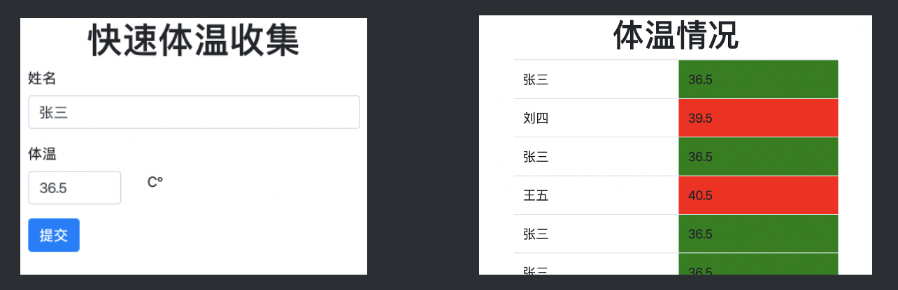

# AWS SAM 简易体温收集工具演示

使用 AWS SAM 来创建一个简易的体温收集工具，支持本地调试、云端部署。



## 免责声明

建议测试过程中使用此方案，生产环境使用请自行考虑评估。

当您对方案需要进一步的沟通和反馈后，可以联系 nwcd_labs@nwcdcloud.cn 获得更进一步的支持。

欢迎联系参与方案共建和提交方案需求，也欢迎在 GitHub 项目 issues 中留言反馈 Bug。

## 使用方式

### 准备工作

安装：

- [AWS 命令行工具](https://docs.aws.amazon.com/cli/latest/userguide/cli-chap-install.html)
- [SAM 命令行工具](https://docs.aws.amazon.com/serverless-application-model/latest/developerguide/serverless-sam-cli-install.html)
- [Docker](https://docs.docker.com/install/)

确定 Docker 处于运行状态。

### 本地启动 DynamoDB Local

在 `corcheck` 目录下运行：

```
docker run -p 8000:8000 \
           --name dynamodb \
           --network local-dev \
           --network-alias=dynamodb \
           amazon/dynamodb-local \
           -jar DynamoDBLocal.jar -inMemory -sharedDb
```

再运行如下命令来创建表：

```
aws dynamodb create-table \
    --endpoint-url http://localhost:8000 \
    --table-name SampleTable \
    --key-schema "$(cat keys.json)" \
    --attribute-definitions "$(cat scheme.json)" \
    --provisioned-throughput=ReadCapacityUnits=1,WriteCapacityUnits=1
```

### 本地启动 API Gateway + Lambda

在 `corcheck` 目录下运行：

```
sam local start-api --docker-network local-dev
```

保持这个窗口不关闭，再切换一个新的命令行窗口，运行：

```
curl http://localhost:3000
```

进行测试。

### 本地启动 Web 服务器并测试

进入 `corcheck/web` 目录，运行：

```
python -m http.server 8888
```

打开浏览器的 `http://localhost:8888/form.html` 来输入信息，并到 `http://localhost:8888/list.html` 查看结果。确认可用。

### 正式部署

在 `corcheck` 目录执行：


```
sam deploy --stack-name sam-test \
           --bucket-name sam-test-s3 \
           --capabilities CAPABILITY_IAM
```

即可部署。

### 修改前端页面

到 AWS 控制台（网页端）找到 API Gateway 服务，进入 Dashboard，复制 API Gateway 地址。用真实地址替换 `form.html` 和 `list.html` 中的 `https://xxxxxxxxx.execute-api.cn-northwest-1.amazonaws.com.cn/Prod/` 占位字符串。由于中国区需要备案，可以使用已备案的域名通过 `CNAME` 方式指向 API Gateway。

### 上传前端页面

将前端上传到 S3 或其他 Web 服务器。由于中国区 Web 端口需要备案，请确保前端网页可以正常访问。

上传完毕后，访问该前端页面地址，即可使用。

### 销毁资源

测试完毕后，删除前端页面，进入 AWS 控制台找到 CloudFormation 服务，删除名为 `sam-test` 的 Stack。

## 限制

- HTTP 请求未带鉴权措施，所以 API Gateway 未做 CORS 配置。
- 未对数据来源、数据格式、重复数据等进行清理。